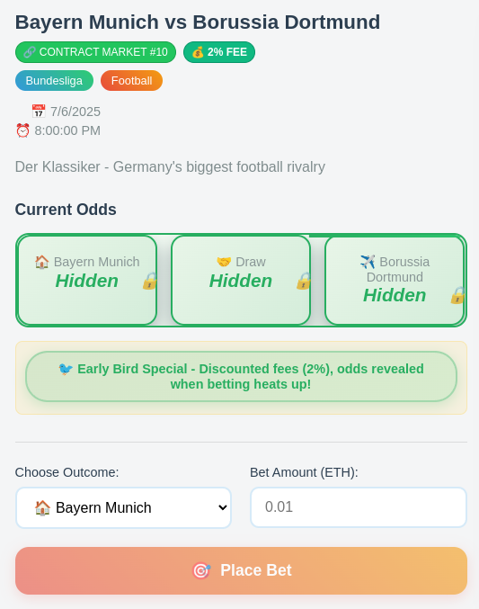
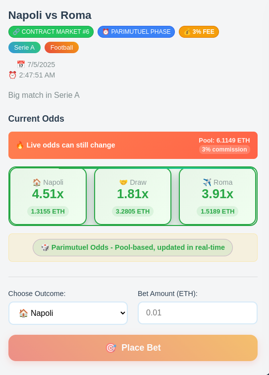

# 🎰 BetZilla - Decentralized Sports Betting Platform

BetZilla è una piattaforma di scommesse sportive decentralizzata costruita su blockchain Ethereum con un innovativo sistema di **Parimutuel Betting** e **Blind Betting**. Gli utenti possono piazzare scommesse con quote dinamiche basate sui pool di scommesse, creando un'esperienza trasparente e anti-manipolazione.

## 🚀 Avvio Rapido

### Avvia Tutto con Un Comando
```bash
./start-betzilla.sh
```

### Spegni Tutto
```bash
./stop-betzilla.sh
```

**È tutto qui!** Il sistema avvia automaticamente:
- 🔗 Hardhat blockchain locale (porta 8545)
- 🖥️ Backend API (porta 4000)
- 🌐 Frontend React (porta 3000)
- 📦 Deploy automatico del contratto
- 🎲 Popolamento database con partite e scommesse test

## 📹 Demo Video - Betting Live in Azione!

**🎥 Guarda BetZilla in azione - Piazzamento scommessa reale con MetaMask:**

[](https://youtu.be/AFbMlGc3xXA)

*Video dimostrativo: connessione MetaMask, piazzamento scommessa, transazione blockchain e aggiornamento portfolio in tempo reale.*

## 🖼️ Due Fasi di Betting - Screenshot

### 🔒 **Blind Betting Phase** (>24h dalla partita)
*Quote nascoste - Early Bird Discount 2% fee*



### 👁️ **Parimutuel Phase** (<24h dalla partita)  
*Quote visibili e live - 3% fee standard*



## 🧪 Testing Completo

### 🎯 **Test LIVE Betting con MetaMask**
**Puoi testare SUBITO il sistema di scommesse reale!**

1. **Avvia il sistema**:
```bash
./start-betzilla.sh
```

2. **Vai sul sito**: http://localhost:3000

3. **Connetti MetaMask**:
   - Configura rete Hardhat (Chain ID: 31337, RPC: http://127.0.0.1:8545)
   - Usa l'account test: `0xf39Fd6e51aad88F6F4ce6aB8827279cffFb92266`
   - Private Key: `0xac0974bec39a17e36ba4a6b4d238ff944bacb478cbed5efcae784d7bf4f2ff80`

4. **Accedi con MetaMask**:
   - Clicca "🦊 Sign in with MetaMask" 
   - Firma il messaggio per autenticarti
   - Il sistema ti registra automaticamente

5. **Vai alla sezione Bet** e **piazza una scommessa**:
   - Scegli una partita
   - Seleziona outcome (Home/Draw/Away)
   - Inserisci importo (es. 0.01 ETH)
   - Clicca "Place Bet"

6. **Verifica che funziona**:
   - ✅ **MetaMask**: Vedrai la transazione e l'ETH sottratto dal wallet
   - ✅ **Blockchain Logs**: Nel terminale dove gira Hardhat vedrai:
     ```
     eth_sendTransaction
     Transaction: 0x123abc...
     Block: #XX
     Gas used: XXXX
     ```
   - ✅ **Portfolio**: La scommessa apparirà nel tuo portfolio
   - ✅ **Database**: Scommessa salvata nel database

### 🔥 **Prova i Due Sistemi di Betting**

**Sistema Parimutuel (Partite entro 24h)**:
- Quote **live** che cambiano in tempo reale
- Fee 3% - quote visibili
- Pool condiviso tra tutti i giocatori

**Sistema Early Bird (Partite >24h)**:
- Quote **nascoste** (blind betting)
- Fee 2% - sconto early bird!
- Quote rivelate solo quando si avvicina la partita

### Test dal Sito Web 
1. Vai su: http://localhost:3000
2. Testa il piazzamento scommesse in modalità test
3. Visualizza le quote parimutuel live per partite entro 24h
4. Prova il blind betting per partite future

### Test Automatico Completo
Per testare **tutto** il sistema (distribuzione vincite, raccolta fee, calcoli parimutuel, edge cases):

```bash
./test-parimutuel.sh
```

Questo script testa:
- ✅ Sistema completo di scommesse
- ✅ Calcoli parimutuel accurati
- ✅ Distribuzione vincite corretta
- ✅ Raccolta fee (2% early, 3% live)
- ✅ Edge cases e validazioni
- ✅ Integrazione backend
- ✅ Gestione errori

## 🌟 Caratteristiche Principali

### 🎯 **Sistema Parimutuel Innovativo**
- **Quote Dinamiche**: Le quote cambiano in base alla distribuzione delle scommesse nel pool
- **Trasparenza Totale**: Formula: `Odds = (Pool Totale - Fee) / Importo su Outcome`
- **Aggiornamenti Live**: Quote aggiornate ogni 30 secondi per partite entro 24h
- **Anti-Manipolazione**: Nessuna casa può manipolare le quote

### 💰 **Sistema di Fee Dinamico**
- **Early Betting (>24h)**: 2% fee, quote nascoste (blind betting)
- **Parimutuel Phase (<24h)**: 3% fee, quote visibili e live
- **Incentivo Anticipato**: Premia chi scommette prima con fee ridotta

### 🔒 **Blind Betting**
- **Scommesse Cieche**: Piazzi scommesse prima che le quote vengano rivelate
- **Trasparenza Blockchain**: Tutte le transazioni registrate e verificabili
- **Nessuna Manipolazione**: Quote rivelate solo nella fase finale

### 📊 **Gestione Avanzata**
- **Scommesse Multiple**: Più scommesse sullo stesso mercato
- **Portfolio Completo**: Tracking scommesse attive e risolte
- **Claim Automatico**: Ritiro vincite quando partite sono risolte

## 🎲 Come Funziona

### Fasi di Betting
1. **Early Phase (>24h prima della partita)**:
   - Fee: 2% (Early Bird Discount! 🐦)
   - Quote: Nascoste (blind betting)
   - Vantaggio: Fee ridotta per chi scommette prima

2. **Parimutuel Phase (<24h prima della partita)**:
   - Fee: 3% (standard)
   - Quote: Visibili e aggiornate live
   - Vantaggio: Vedi esattamente su cosa stai scommettendo

3. **Match Started**:
   - Scommesse: Chiuse
   - Quote: Finali per calcolo vincite

### Esempio Pratico
```
Early Phase: Real Madrid vs Barcelona (48h prima)
├── Scommetti: 1 ETH su Real Madrid
├── Fee: 2% (0.02 ETH) - Early Bird!
└── Status: "🔒 Quote rivelate quando si scalda il betting!"

Parimutuel Phase: (12h prima)
├── Pool Totale: 13.32 ETH
├── Su Real Madrid: 6.05 ETH
├── Fee: 3% → Net Pool: 12.92 ETH
└── Quote Real Madrid: 12.92 / 6.05 = 2.14x
```

## 🏗️ Architettura

```
BetZilla/
├── contracts/          # Smart Contracts Solidity
├── backend/           # API Node.js/Express  
├── frontend/         # React App
├── start-betzilla.sh # Avvio tutto
├── stop-betzilla.sh  # Spegni tutto
└── test-parimutuel.sh # Test completo
```

## 📱 Interfaccia

### 🌐 **Frontend** (http://localhost:3000)
- **Live Odds**: Quote parimutuel in tempo reale
- **Bet Placement**: Piazzamento scommesse **reali** con MetaMask
- **Portfolio**: Tracking scommesse e vincite
- **MetaMask Integration**: Autenticazione e transazioni blockchain

### 🖥️ **Backend** (http://localhost:4000)
- **API Matches**: Endpoint partite disponibili
- **Parimutuel Calculations**: Calcoli quote dinamiche
- **Database**: Storage scommesse e risultati

### 🔗 **Blockchain** (http://localhost:8545)
- **Smart Contract**: Logica scommesse decentralizzata **attiva**
- **Hardhat Node**: Blockchain locale per sviluppo
- **MetaMask**: Connessione wallet **funzionante** con transazioni reali

## 🛠️ Setup Tecnico Avanzato

### Prerequisiti
- Node.js 16+
- npm/yarn
- MetaMask (opzionale)

### Configurazione MetaMask (Opzionale)
```
Network: Hardhat Local
RPC URL: http://127.0.0.1:8545
Chain ID: 31337
Currency: ETH

Account Test:
Address: 0xf39Fd6e51aad88F6F4ce6aB8827279cffFb92266
Private Key: 0xac0974bec39a17e36ba4a6b4d238ff944bacb478cbed5efcae784d7bf4f2ff80
```

### Installazione Manuale
```bash
# Clone repository
git clone <repo-url>
cd betzilla

# Installa dipendenze
cd contracts && npm install
cd ../backend && npm install  
cd ../frontend && npm install

# Avvio manuale
cd contracts && npx hardhat node        # Terminal 1
npx hardhat run scripts/deploy.js       # Terminal 2
cd ../backend && npm start              # Terminal 3
cd ../frontend && npm start             # Terminal 4
```

## 🔧 Sviluppo

### Smart Contract (BetZilla.sol)
- **placeBet()**: Piazzamento scommesse con validazione
- **createMarket()**: Creazione mercati scommesse
- **resolveMarket()**: Risoluzione con outcome vincente
- **claimWinnings()**: Ritiro vincite automatico

### API Backend
- **GET /api/matches**: Lista partite disponibili
- **GET /api/matches/:id/odds**: Quote parimutuel live
- **POST /api/test-bet**: Piazzamento scommesse test
- **GET /api/health**: Status sistema

### Frontend React
- **useBetzilla.js**: Hook interazione smart contract
- **App.js**: Interfaccia principale responsive
- **Live Updates**: Aggiornamento quote ogni 30s

## 🚨 Risoluzione Problemi

### Errori Comuni
- **"Port in use"**: Usa `./stop-betzilla.sh` prima di riavviare
- **"Contract not deployed"**: Riavvia con `./start-betzilla.sh`
- **"MetaMask error"**: Configura rete Hardhat (ChainID 31337)

### Debug
```bash
# Controlla processi
ps aux | grep -E "(hardhat|node|react)"

# Controlla porte
lsof -i :3000,4000,8545

# Log applicazioni
tail -f hardhat.log backend.log frontend.log
```

## 📈 Roadmap

- [ ] **Mobile App**: Applicazione nativa iOS/Android
- [ ] **Multi-Sport**: Supporto calcio, basket, tennis, F1
- [ ] **Layer 2**: Integrazione Polygon/Arbitrum
- [ ] **Oracle Integration**: Feed risultati automatici
- [ ] **DAO Governance**: Sistema governance decentralizzato
- [ ] **DeFi Integration**: Yield farming e staking

## 🤝 Contribuire

1. Fork del repository
2. Crea branch feature (`git checkout -b feature/NuovaFeature`)
3. Commit modifiche (`git commit -m 'Aggiungi NuovaFeature'`)
4. Push branch (`git push origin feature/NuovaFeature`)
5. Apri Pull Request

## 📄 Licenza

Progetto rilasciato sotto licenza MIT.

---

**⚠️ Disclaimer**: Progetto dimostrativo. Non utilizzare per scommesse reali senza appropriate licenze e conformità normative.

**🎯 Quick Start**: `./start-betzilla.sh` → http://localhost:3000 → **Divertiti!** 🚀